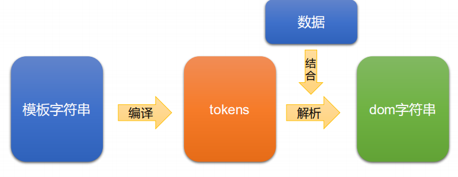
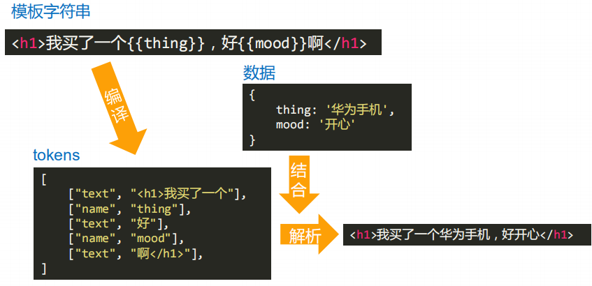

# mustache模板引擎

**模板引擎是将数据要变为视图最优雅的解决方案**

mustache官方git： https://github.com/janl/mustache.js

[相关技术博客](https://dried-mango.gitee.io/2021/01/08/mustache%E6%A8%A1%E6%9D%BF%E5%BC%95%E6%93%8E/)

# mustache的底层核心机理

**mustache库底层重点要做两个事情：**

① 将模板字符串编译为tokens形式

② 将tokens结合数据，解析为dom字符串

**tokens**是一个JS的嵌套数组，即模板字符串的JS表示，它是“抽象语法树”、“虚拟节点”等等的开山鼻祖